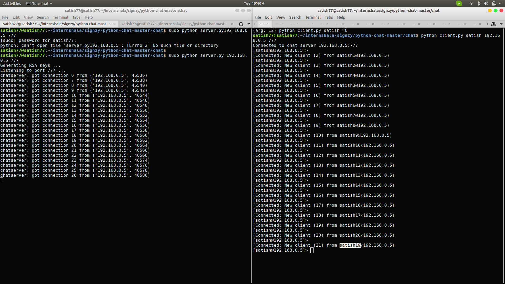
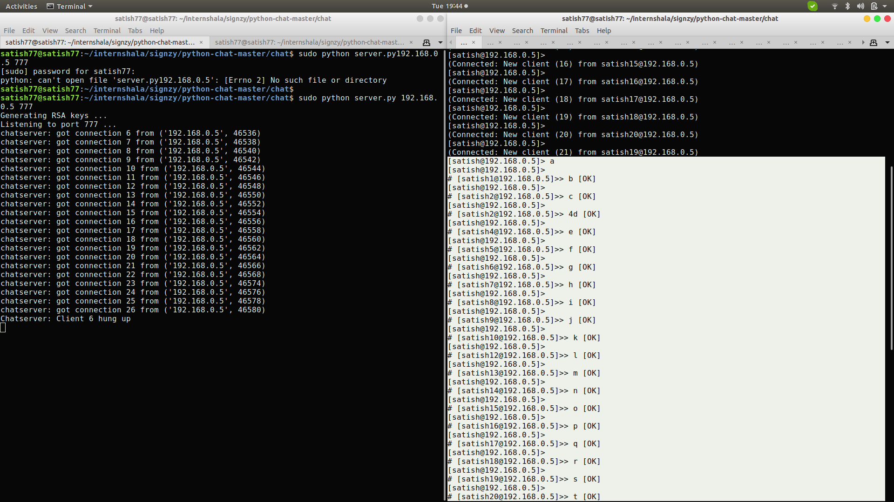

A simple Python chatroom with RSA keys authentication
=====================================================

About
-----

This is a simple chatserver that uses server-client RSA key based authentication.
I added dynamic keypair generation for server and clients (on startup each generates
4096b long key) and exchanges public keys when connected.
This way there is no need to create encrypted keys for clients and server.

To be sure that communication really is encrypted, you can use wireshark,
or git pull the repo and edit server.py part where messages are recieved and
print them.

Installation:
-------------
    https://github.com/satishs97/CLI_Chatapp.git
    pip install -r REQUIREMENTS.txt

For server:
-----------
    python server.py listen_ip listen_port

For clients:
------------
    python client.py username server_ip server_port
    
   

